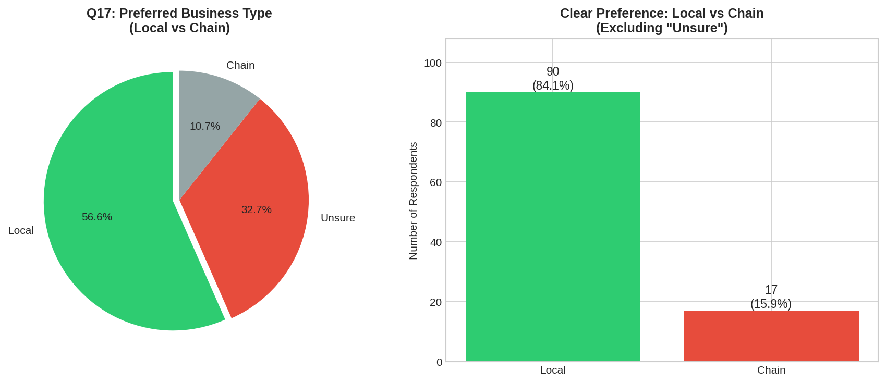
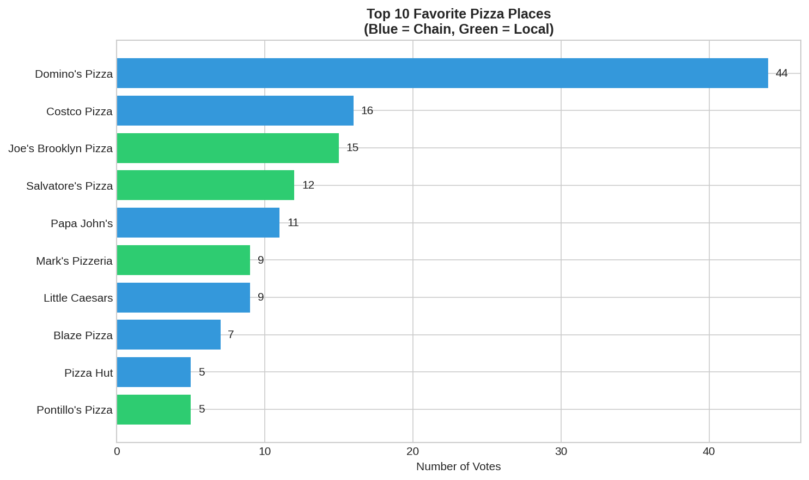
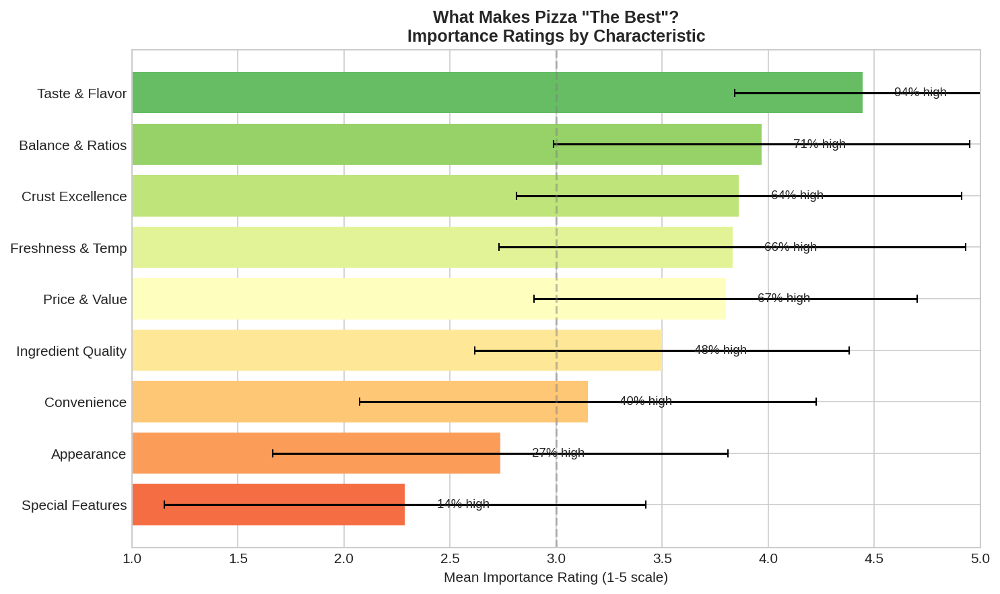
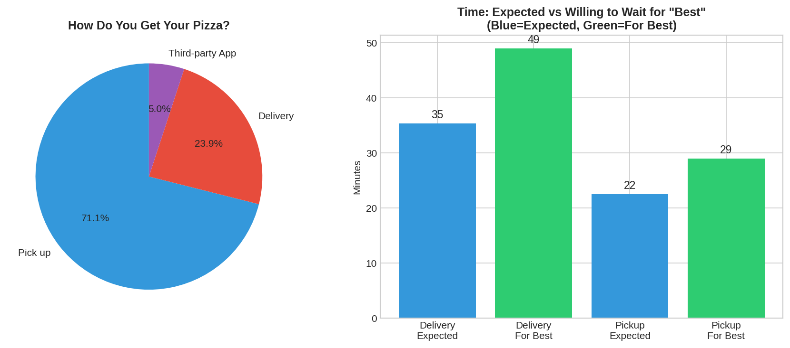
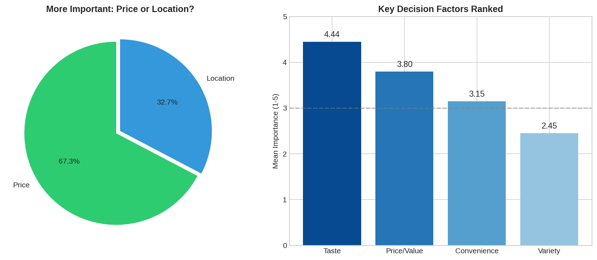
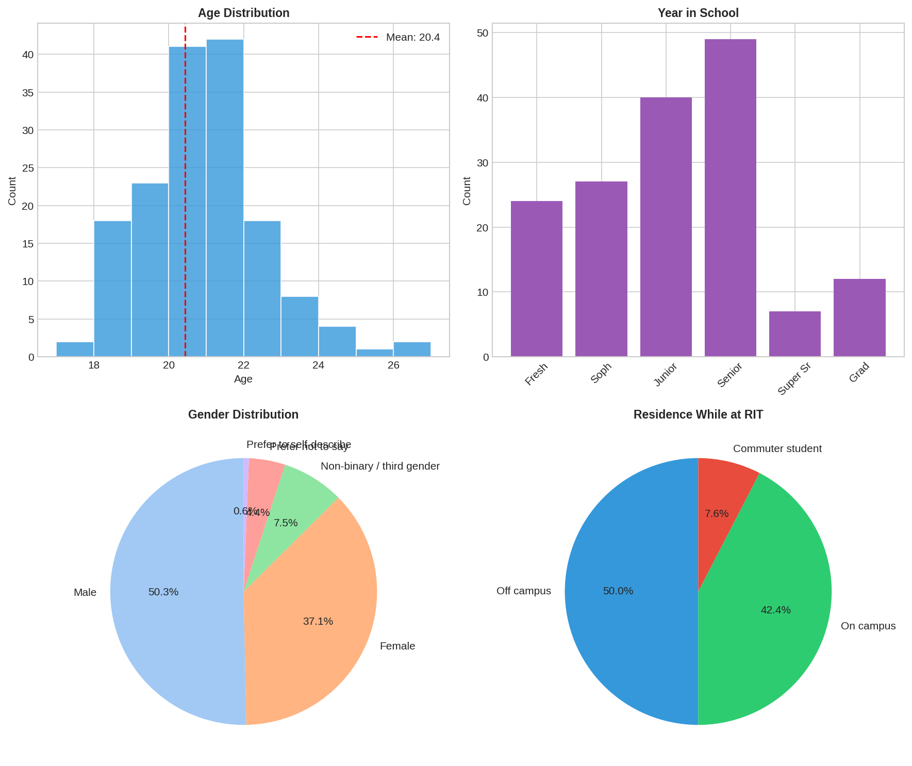

# Executive Summary: RIT Pizza Survey

**What is the Best Pizza Available to RIT Students?**

*BANA255 Survey Analysis | November 2025 | n=161 respondents*

---

## At a Glance

| Metric | Value |
|--------|-------|
| Survey Responses | 161 |
| Mean Age | 20.4 years |
| Orders per Month | 2.5 (mean) |
| Top Restaurant | Domino's Pizza (27%) |
| Most Important Factor | Taste (4.44/5) |

---

## Key Findings

### 1. The Local-Chain Paradox

**84% say they prefer local pizza places, yet Domino's (a chain) wins.**

| Preference | % of Respondents |
|------------|------------------|
| Local | 56.6% |
| Unsure | 32.7% |
| Chain | 10.7% |

**Insight**: When excluding "Unsure" responses, 84.1% prefer local establishments (p < 0.001). However, actual behavior doesn't match—Domino's captures 27% of "favorite" votes. This suggests **price and convenience override stated preferences**.

---

### 2. Restaurant Rankings

**Chain restaurants dominate the top 5 despite stated local preference.**

| Rank | Restaurant | Votes | Type |
|------|------------|-------|------|
| 1 | Domino's Pizza | 44 | Chain |
| 2 | Costco Pizza | 16 | Chain |
| 3 | Joe's Brooklyn Pizza | 15 | Local |
| 4 | Salvatore's Pizza | 12 | Local |
| 5 | Papa John's | 11 | Chain |

**Insight**: 6 of the top 10 are chains. Joe's Brooklyn is the top-rated local establishment.

---

### 3. What Makes Pizza "The Best"?

**Taste dominates—94% rate it as highly important.**

| Rank | Characteristic | Mean (1-5) | % High Importance |
|------|----------------|------------|-------------------|
| 1 | **Taste & Flavor** | 4.44 | 94.4% |
| 2 | Balance & Ratios | 3.97 | 71.2% |
| 3 | Crust Excellence | 3.86 | 64.4% |
| 4 | Freshness & Temp | 3.83 | 65.6% |
| 5 | Price & Value | 3.80 | 66.9% |
| ... | ... | ... | ... |
| 9 | Special Features | 2.29 | 13.8% |

**Insight**: Core quality matters; novelty doesn't. The Friedman test confirms these differences are statistically significant (p < 0.001).

---

### 4. Pickup vs Delivery

**71% prefer pickup. Students will wait extra for quality.**

| Method | % |
|--------|---|
| Pickup | 71.1% |
| Delivery | 23.9% |
| Third-party Apps | 5.0% |

**Time Expectations**:
| Scenario | Expected | For "Best" | Extra Time |
|----------|----------|------------|------------|
| Delivery | 35 min | 49 min | **+14 min** |
| Pickup | 23 min | 29 min | **+6 min** |

**Insight**: Students are willing to wait 40% longer for delivery if it means getting "the best" pizza. Paired t-tests confirm this difference is significant (p < 0.001).

---

### 5. Decision Factors Ranked

**Taste > Price > Convenience > Variety**

| Factor | Mean Score | Statistical Comparison |
|--------|------------|------------------------|
| **Taste** | 4.44 | — |
| **Price/Value** | 3.80 | Taste > Price (p < 0.001) |
| **Convenience** | 3.15 | Price > Convenience (p < 0.001) |
| **Variety** | 2.45 | Convenience > Variety (p < 0.001) |

**Additional Finding**: When asked directly, 67% say **price is more important than location**.

---

## Demographics

| Demographic | Breakdown |
|-------------|-----------|
| **Age** | Mean 20.4 years (range: 17-26) |
| **Year** | Senior (30%), Junior (25%), Sophomore (17%), Freshman (15%), Grad (7%) |
| **Gender** | Male (50%), Female (37%), Non-binary (8%) |
| **Residence** | Off-campus (49%), On-campus (42%), Commuter (8%) |
| **Transportation** | Yes (64%), No (36%) |

---

## Strategic Implications

### For Local Pizza Shops
- **Compete on taste first**—it's the #1 factor by far
- Price competitively—students are price-sensitive
- Emphasize pickup convenience over delivery
- Don't invest heavily in "special features"—students don't value novelty

### For Chain Restaurants
- Current strategy is working—convenience + price wins behavior
- Maintain consistent quality (taste/balance)
- Continue focus on efficient pickup operations

### For RIT Dining
- Only 2.5% chose RIT Dining as favorite
- Opportunity to improve pizza offerings
- Location advantage underutilized

---

## Open Research Questions

1. **Why the paradox?** What specifically drives students to chains despite preferring local?
2. **Loyalty drivers** What predicts high loyalty scores?
3. **Demographic segments** Do on-campus vs off-campus students differ?
4. **Price elasticity** What's the willingness-to-pay curve?

---

## Files Generated

| File | Description |
|------|-------------|
| `outputs/fig1_local_vs_chain.png` | Local vs chain preference charts |
| `outputs/fig2_top_pizza_places.png` | Restaurant rankings bar chart |
| `outputs/fig3_importance_ratings.png` | Pizza quality importance ratings |
| `outputs/fig4_order_time_preferences.png` | Order method & time preferences |
| `outputs/fig5_decision_factors.png` | Decision factor comparison |
| `outputs/fig6_demographics.png` | Demographic breakdown |
| `outputs/summary_statistics.csv` | Key metrics in CSV format |
| `outputs/restaurant_rankings.csv` | Full restaurant rankings |

---

*For methodology details, see [METHODOLOGY.md](METHODOLOGY.md). For full findings, see [FINDINGS_REPORT.md](FINDINGS_REPORT.md).*

*Analysis script: `generate_summary.py` | Statistical analysis: `pizza_analysis.py`*
