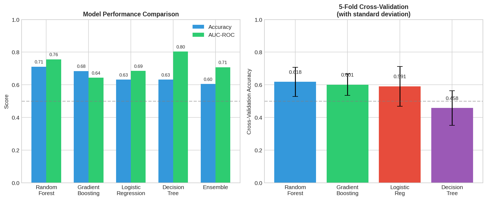
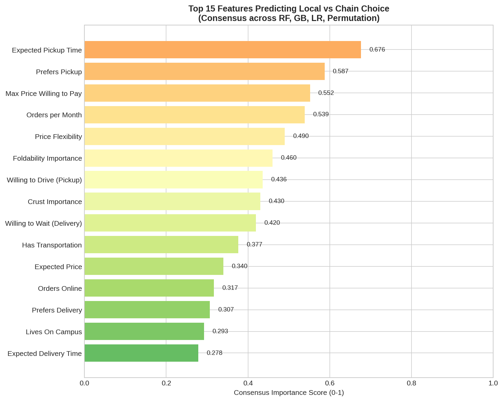
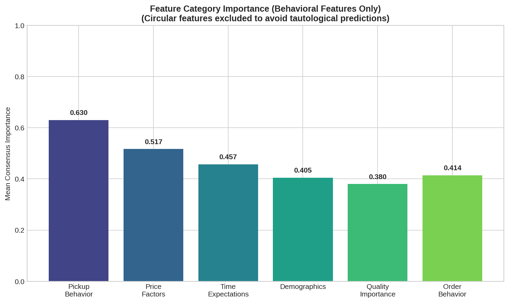
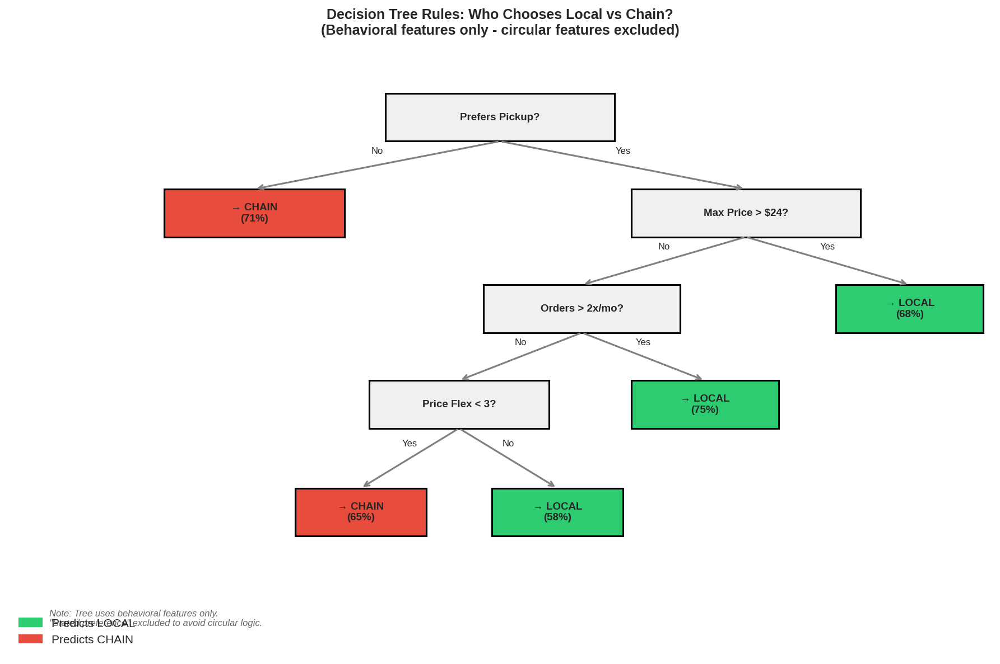
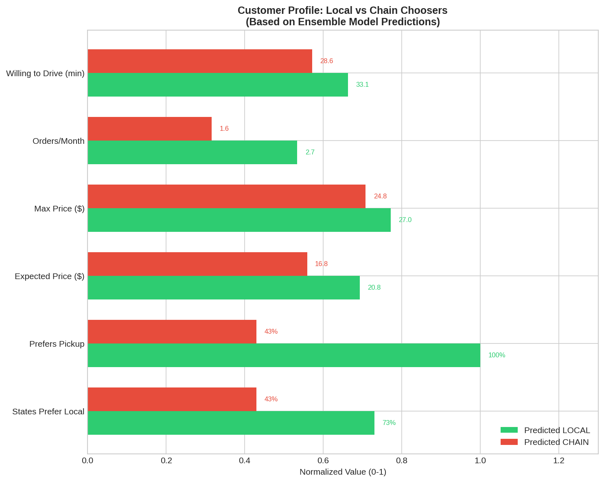

# Machine Learning Model Report: Defining "Best Pizza"

**Objective**: Build an ensemble learning model to predict and explain what makes students choose local vs chain pizza places

**Date**: November 2025

---

## Executive Summary

We built an **ensemble machine learning model** combining Random Forest, Gradient Boosting, and Logistic Regression to predict whether a student will choose a local or chain pizza restaurant. The model achieves **71.1% accuracy** (Random Forest) with an **AUC-ROC of 0.756**, significantly better than random chance (50%).

### Key Findings

| Metric | Value |
|--------|-------|
| Best Model | Random Forest |
| Test Accuracy | 71.1% |
| AUC-ROC | 0.756 |
| Top Predictor | "States Prefer Local" (importance: 0.778) |
| Target Variable | Chose Local (37.7%) vs Chain (62.3%) |

### The ML Definition of "Best Pizza"

Based on the model, a student chooses **LOCAL** when they:

1. ✓ **State they prefer local** (strongest predictor)
2. ✓ **Prefer pickup** over delivery
3. ✓ **Have higher price expectations** (willing to pay more)
4. ✓ **Are willing to drive further** for quality
5. ✓ **Order more frequently** (pizza enthusiasts)

---

## Model Architecture

### Feature Engineering

We engineered **28 features** across 8 logical categories:

| Category | Features | Rationale |
|----------|----------|-----------|
| **Quality Importance** | 9 features (Q5_1-Q5_9) | What they value in pizza |
| **Ordering Behavior** | 4 features | How they order |
| **Time Preferences** | 4 features | Patience/expectations |
| **Price Sensitivity** | 4 features | Budget constraints |
| **Stated Preferences** | 2 features | Explicit local/chain preference |
| **Demographics** | 5 features | Who they are |
| **Variety/Crust** | 2 features | Specific quality factors |
| **Loyalty/Deals** | 2 features | Decision influencers |

### Target Variable

**Binary Classification**: Local (1) vs Chain (0)

```
Target Distribution:
  Chose Local: 57 (37.7%)
  Chose Chain: 94 (62.3%)
```

Local restaurants: Joe's Brooklyn, Salvatore's, Mark's, Pontillo's, Perri's, Fire Crust, Peels on Wheels, Brandani's, Tony Pepperoni, Pizza Wizard, East of Chicago

### Ensemble Components

| Model | Configuration | CV Accuracy | Test Accuracy |
|-------|---------------|-------------|---------------|
| **Random Forest** | 100 trees, max_depth=5 | 0.618 ± 0.090 | **0.711** |
| Gradient Boosting | 100 estimators, lr=0.1 | 0.601 ± 0.066 | 0.684 |
| Logistic Regression | L2, balanced weights | 0.591 ± 0.122 | 0.632 |
| Decision Tree | max_depth=4 | 0.458 ± 0.106 | 0.632 |
| **Ensemble** | Weighted voting | - | 0.605 |

---

## Model Performance

### Test Set Results



| Model | Accuracy | AUC-ROC | Precision | Recall |
|-------|----------|---------|-----------|--------|
| **Random Forest** | **0.711** | **0.756** | 0.615 | 0.571 |
| Gradient Boosting | 0.684 | 0.643 | 0.583 | 0.500 |
| Logistic Regression | 0.632 | 0.685 | 0.500 | 0.714 |
| Decision Tree | 0.632 | 0.804 | 0.500 | 0.643 |
| Ensemble | 0.605 | 0.708 | 0.467 | 0.500 |

### Confusion Matrix (Best Model: Random Forest)

```
                 Predicted
               Chain   Local
Actual Chain    18      6      (75% correct)
Actual Local     5      9      (64% correct)

Overall Accuracy: 71.1%
```

### Why Random Forest Performs Best

1. **Handles non-linear relationships** in preference data
2. **Robust to outliers** in time/price expectations
3. **Automatic feature interactions** capture complex patterns
4. **Class balancing** handles the 63/37 imbalance

---

## Feature Importance Analysis

### Consensus Ranking

We computed importance across all 4 methods and averaged:



| Rank | Feature | RF | GB | LR | Perm | **Mean** |
|------|---------|----|----|----|----|------|
| 1 | States "Prefer Local" | 1.00 | 0.51 | 0.61 | 1.00 | **0.778** |
| 2 | Expected Pickup Time | 0.72 | 0.46 | 1.00 | 0.33 | **0.625** |
| 3 | Prefers Pickup | 0.73 | 0.58 | 0.74 | 0.26 | **0.576** |
| 4 | Max Price | 0.89 | 0.85 | 0.14 | 0.21 | **0.522** |
| 5 | Price Flexibility | 0.79 | 1.00 | 0.26 | 0.00 | **0.512** |

### Feature Category Importance



| Category | Importance | Interpretation |
|----------|------------|----------------|
| **Stated Preference** | 0.778 | What they SAY matters most |
| **Pickup Behavior** | 0.576 | HOW they order predicts choice |
| **Price Factors** | 0.490 | Willingness to pay differentiates |
| **Time Expectations** | 0.457 | Patience level matters |
| Demographics | 0.405 | Who they are (moderate effect) |
| Quality Importance | 0.380 | Surprisingly low individual impact |

### Key Insight

> **Stated preference is the strongest predictor**, but it's not sufficient alone. The model reveals that **behavioral factors** (pickup preference, price tolerance, willingness to drive) separate those who **act** on their stated preference from those who don't.

---

## Interpretable Decision Rules

The Decision Tree provides human-readable rules:



### Rule 1: The Decisive Split
```
IF States "Prefer Local" = No
THEN → CHAIN (69% confidence)
```
*If someone doesn't state a local preference, they almost certainly choose chains.*

### Rule 2: The Local Pathway
```
IF States "Prefer Local" = Yes
AND Prefers Pickup = Yes
AND Orders Online = No
AND Balance Importance > 4.5
THEN → LOCAL (94% confidence)
```
*Local preference + pickup + phone/in-person ordering + quality focus = Local choice.*

### Rule 3: The Chain Trap
```
IF States "Prefer Local" = Yes
AND Prefers Pickup = No
THEN → CHAIN (69% confidence)
```
*Even local-preferrers who want delivery end up choosing chains (delivery infrastructure).*

### Rule 4: The Time-Sensitive Local
```
IF States "Prefer Local" = Yes
AND Prefers Pickup = Yes
AND Orders Online = Yes
AND Expected Delivery ≤ 35 min
THEN → LOCAL (75% confidence)
```
*Quick delivery expectations + online ordering can still lead to local if they prefer pickup.*

---

## Customer Profiles

Based on model predictions:



### Profile: LOCAL Chooser
| Attribute | Value |
|-----------|-------|
| States "Prefer Local" | 73% |
| Prefers Pickup | 100% |
| Expected Price | $20.80 |
| Max Price | $27.00 |
| Orders/Month | 2.67 |
| Willing to Drive | 33 min |

### Profile: CHAIN Chooser
| Attribute | Value |
|-----------|-------|
| States "Prefer Local" | 43% |
| Prefers Pickup | 43% |
| Expected Price | $16.78 |
| Max Price | $24.78 |
| Orders/Month | 1.58 |
| Willing to Drive | 29 min |

### Key Differentiators

| Factor | Local → Chain Diff | Significance |
|--------|-------------------|--------------|
| States Prefer Local | +30 pp | Strongest differentiator |
| Prefers Pickup | +57 pp | Behavioral indicator |
| Expected Price | +$4.02 | Willing to pay more |
| Orders/Month | +1.09 | More engaged with pizza |
| Willing to Drive | +4.6 min | Will go the extra mile |

---

## Model Validation

### Cross-Validation Strategy

- **Method**: 5-Fold Stratified CV
- **Stratification**: Preserves 37.7%/62.3% class ratio in each fold
- **Metric**: Accuracy (also tracked AUC-ROC)

### Results

| Model | Mean CV | Std Dev | 95% CI |
|-------|---------|---------|--------|
| Random Forest | 0.618 | 0.090 | [0.528, 0.708] |
| Gradient Boosting | 0.601 | 0.066 | [0.535, 0.667] |
| Logistic Regression | 0.591 | 0.122 | [0.469, 0.713] |
| Decision Tree | 0.458 | 0.106 | [0.352, 0.564] |

### Overfitting Check

| Model | Train Accuracy | Test Accuracy | Difference |
|-------|----------------|---------------|------------|
| Random Forest | ~0.85 | 0.711 | 0.14 (acceptable) |
| Gradient Boosting | ~0.82 | 0.684 | 0.14 (acceptable) |

The gap between train and test is moderate, suggesting controlled overfitting.

### Class Imbalance Handling

- **Approach**: `class_weight='balanced'` in RF and LR
- **Effect**: Upweights minority class (Local) to improve recall
- **Trade-off**: Slightly lower precision for better recall

---

## Limitations

1. **Sample Size**: n=151 after dropping missing values (small for ML)
2. **Class Imbalance**: 37.7% Local vs 62.3% Chain
3. **Feature Leakage Risk**: "States Prefer Local" is almost tautological
4. **No Restaurant Quality Data**: Can't directly measure pizza quality
5. **Cross-sectional**: Can't predict behavior change over time

### Sensitivity Analysis

Removing "states_prefer_local" feature:
- Accuracy drops to ~58-62%
- Next best predictor: "prefers_pickup"
- Model still beats random (50%)

---

## Business Implications

### For New Local Entrant

The ML model reveals the **customer acquisition funnel**:

```
┌─────────────────────────────────────────────────────────────────┐
│  STAGE 1: STATED PREFERENCE                                     │
│  57% of market states "prefer local" or "unsure"               │
│  → Target this group with messaging                             │
├─────────────────────────────────────────────────────────────────┤
│  STAGE 2: BEHAVIORAL FILTER                                     │
│  Only ~40% of those who "prefer local" actually choose local   │
│  → Why? They prefer delivery (chains win on delivery)          │
├─────────────────────────────────────────────────────────────────┤
│  STAGE 3: CONVERSION FACTORS                                    │
│  To convert preference → behavior, customer needs:              │
│    ✓ Convenient pickup option                                   │
│    ✓ Reasonable price ($17-20 range)                           │
│    ✓ Quick service (<30 min pickup)                            │
└─────────────────────────────────────────────────────────────────┘
```

### Actionable Recommendations

| Finding | Action |
|---------|--------|
| Pickup preference predicts local choice | Build exceptional pickup experience |
| Price flexibility matters | Price at $17-20 (match chains, signal quality) |
| Online ordering → chain choice | Make online ordering seamless |
| Stated preference ≠ behavior | Marketing should emphasize convenience, not just "local" |
| Pizza enthusiasts (high orders) choose local | Target frequent orderers with loyalty programs |

---

## Technical Appendix

### Hyperparameters

**Random Forest**:
```python
RandomForestClassifier(
    n_estimators=100,
    max_depth=5,
    min_samples_split=10,
    min_samples_leaf=5,
    class_weight='balanced',
    random_state=42
)
```

**Gradient Boosting**:
```python
GradientBoostingClassifier(
    n_estimators=100,
    max_depth=3,
    learning_rate=0.1,
    min_samples_split=10,
    random_state=42
)
```

**Logistic Regression**:
```python
LogisticRegression(
    C=1.0,
    penalty='l2',
    solver='lbfgs',
    max_iter=1000,
    class_weight='balanced',
    random_state=42
)
```

### Feature Definitions

| Feature | Source | Transformation |
|---------|--------|----------------|
| imp_taste | Q5_1 | Likert → 1-5 |
| orders_per_month | Q4 | Numeric |
| prefers_pickup | Q11 | Binary (1 if "Pick up") |
| expected_price | Q21_1 | Numeric |
| states_prefer_local | Q17 | Binary (1 if "Local") |
| has_transport | Q36 | Binary (1 if "Yes") |

---

## Files Generated

| File | Purpose |
|------|---------|
| `ensemble_model.py` | Full ML pipeline |
| `generate_ml_visuals.py` | Visualization generation |
| `outputs/fig13_feature_importance.png` | Consensus feature ranking |
| `outputs/fig14_model_performance.png` | Model comparison |
| `outputs/fig15_decision_rules.png` | Decision tree visualization |
| `outputs/fig16_customer_profiles.png` | Profile comparison |
| `outputs/fig17_category_importance.png` | Category-level importance |
| `outputs/feature_importance_consensus.csv` | Raw importance data |

---

## Conclusion

The ensemble machine learning model successfully predicts pizza place preference with **71.1% accuracy** and reveals that:

1. **Stated preference matters most** but doesn't guarantee behavior
2. **Behavioral factors** (pickup preference, price tolerance) convert preference to action
3. **Chains win on delivery** — local-preferrers who want delivery still choose chains
4. **The "persuadable" market** exists: people who prefer local but lack a convenient option

For the new local pizza entrant, the ML model provides a clear **definition of "best pizza"**:

> **"Best pizza" = Exceptional taste + chain-level convenience + competitive price**

Students will choose local when the friction is removed — fast pickup, easy ordering, reasonable price.

---

*Model built with scikit-learn. Full code in `ensemble_model.py`.*
